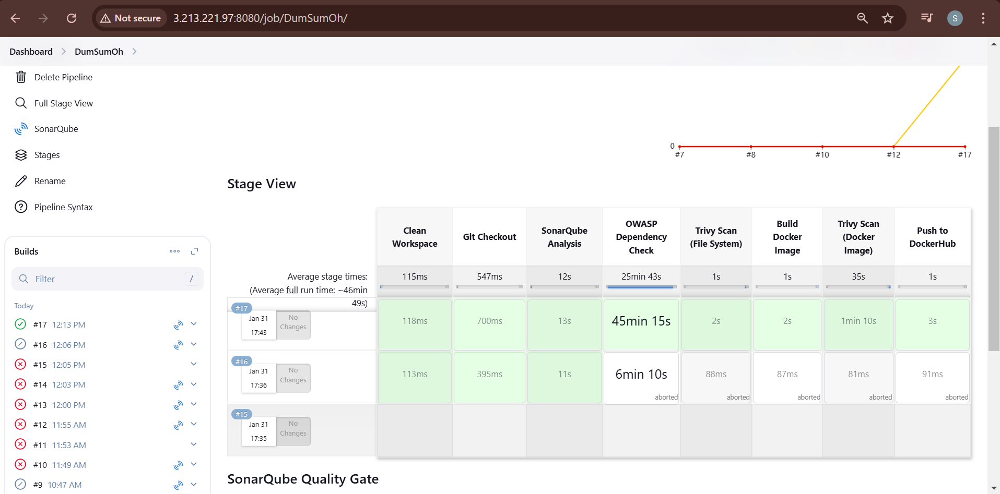
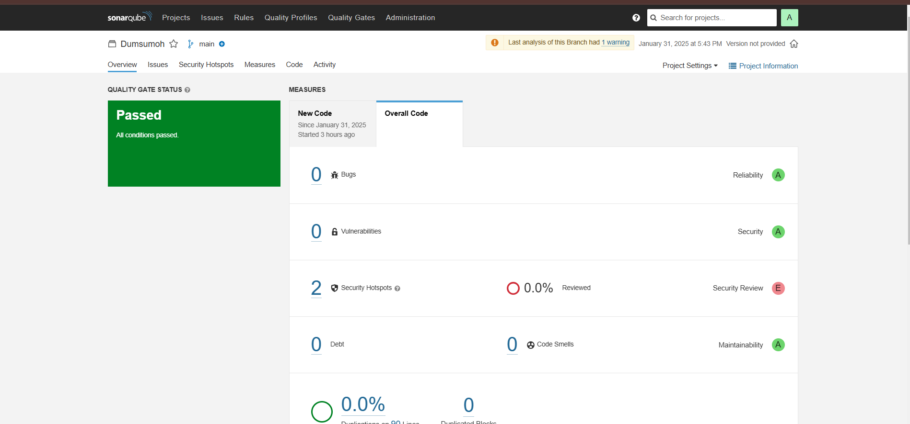

# Sudoku Puzzle App

This is a simple Sudoku puzzle app built using Node.js and Express. The backend generates Sudoku puzzles, and the frontend displays the puzzle in a grid format. The user can interact with the puzzle by filling in the cells.

---
## Installation

### 1. Clone the Repository

To get started, clone this repository to your local machine:

```bash
git clone https://github.com/Priyanshvaishnav/Du-Sum-Oh.git
cd Du-Sum-Oh
```

### 2. Installing
```bash
npm init -y
npm install express
```


### 3. Running the application
```bash
node server.js
```


### 4. Building Docker Image 
For this first you have to login to Docker Desktop
```bash
docker build -t <username_of_docker-desktop>/<Imagename> .

```

### 5. Running Container
```bash
docker run -p 3000:3000 <username>/<imagename>
```
### 6: Pushing 
```bash
docker push <username>/<imagename>:version
```


# Continuous Integration (CI) Setup

This document describes the steps taken for setting up CI using Jenkins, SonarQube, and Trivy.

## Step 1: Install Jenkins, OpenJDK, and SonarQube
- Installed Jenkins, OpenJDK, and SonarQube using Docker images.
- Installed Trivy for security scanning.

## Step 2: Setup Jenkins
- Installed important plugins.
- Connected SonarQube and Jenkins using webhooks.

## Step 3: Create and Run the CI Pipeline
- Configured multiple stages in the Jenkins pipeline.
- Integrated SonarQube for code quality analysis.

---

## **Pipeline Results**
### **1️⃣ CI Pipeline Execution Result**


### **2️⃣ Jenkins Credentials Setup**


### **3️⃣ SonarQube Overview**


---

## **Conclusion**
The CI pipeline successfully executes multiple stages, performs static code analysis with SonarQube, and integrates security scanning with Trivy.


